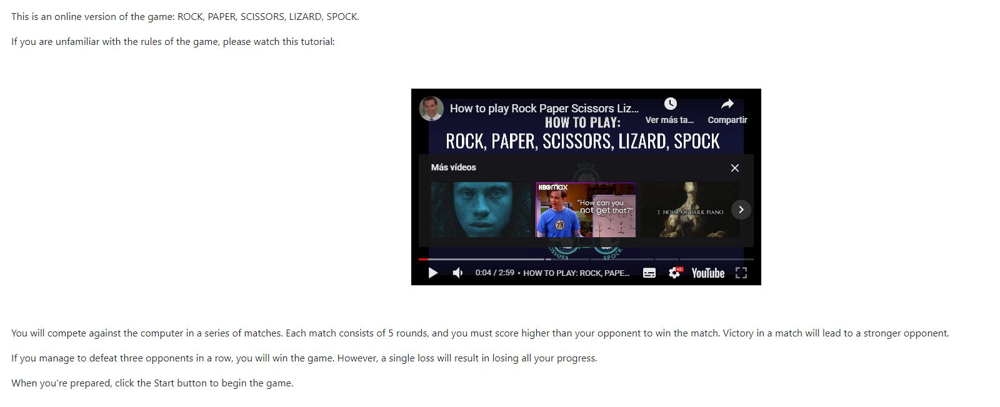
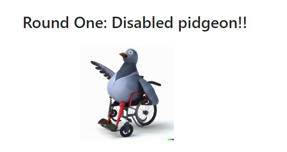
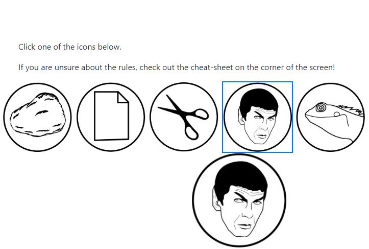
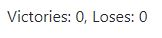
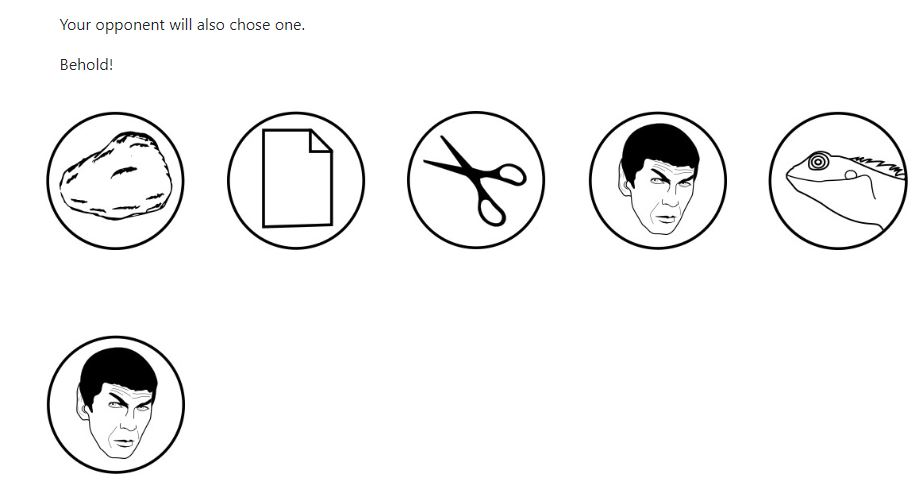
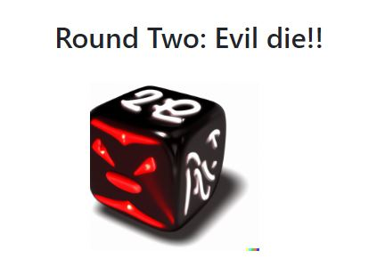
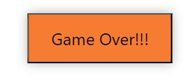

# Rock-Paper-Scissors-Spock-Lizard Game with Two Challenging Rounds
This is a fun and challenging browser-based game of Rock-Paper-Scissors-Spock-Lizard, an extended version of the classic Rock-Paper-Scissors game. The game is played between the user and a computer opponent, and consists of two exciting rounds that progressively increase in difficulty. With each round, the computer opponent's decision-making becomes more intelligent, providing an engaging and enjoyable experience for players of all ages.
## Features

### Header
The header section includes the game title and a cheat sheet image, providing a quick visual reference of the game rules to the player.

### Introduction
An introductory section features a brief explanation and a video tutorial to help players understand the game mechanics.

### Round One
#### Title of the round
A distinct title for the first round.

#### Opponent
Name and brief description of the computer opponent for Round One, along with an image to represent them.

#### Player Column
- All five buttons (Rock, Paper, Scissors, Spock, Lizard) for the user to choose from.
- The player's choice will be displayed below the buttons once a selection is made.

#### Score Screen
A dedicated section to display the current score, including wins and losses.

#### Villain Column
A column analogous to the player column, showing the computer opponent's choice.

### Round Two
A section similar to Round One, featuring a more challenging computer opponent and updated content accordingly.

### Control Buttons
The following buttons will appear based on specific game conditions:

- **Game Over**: If the player accumulates 3 defeats in any given round, the Game Over button will appear.
- **Next Round**: If the player accumulates 3 victories in Round One, the Next Round button will appear.
- **Congratulations!**: If the player accumulates 3 victories in Round Two, the Congratulations! button will appear.

## Rules
In the Rock-Paper-Scissors-Spock-Lizard game, players face off against a computer-controlled opponent in a series of matches. The objective is to win three matches within a round. Each match consists of both the player and the computer opponent choosing one of the five possible options: Rock, Paper, Scissors, Spock, or Lizard. The choices are then compared to determine the winner of the match.
If both the player and the opponent choose the same option, the match is considered a tie, and no points are awarded to either side. To win a match, a player's choice must defeat the opponent's choice according to the following rules:
-	Rock crushes Scissors: Rock wins against Scissors.
-	Scissors cuts Paper: Scissors wins against Paper.
-	Paper covers Rock: Paper wins against Rock.
-	Rock crushes Lizard: Rock wins against Lizard.
-	Lizard poisons Spock: Lizard wins against Spock.
-	Spock smashes Scissors: Spock wins against Scissors.
-	Scissors decapitates Lizard: Scissors wins against Lizard.
-	Lizard eats Paper: Lizard wins against Paper.
-	Paper disproves Spock: Paper wins against Spock.
-	Spock vaporizes Rock: Spock wins against Rock.
The first player to reach three victories within a round wins that round. If the player wins the first round, they will advance to the second round, which features a more challenging computer opponent. To win the game, the player must also win three matches within the second round.
##Rounds
The game has two rounds, each with a unique challenge:
###Round 1
In the first round, the computer opponent always choses the same option: Spock. This round serves as a warm-up and helps players familiarize themselves with the extended game mechanics.
###Round 2
In the second round, the computer opponent becomes more intelligent, using a random pattern. This round significantly increases the difficulty and provides a more engaging gameplay experience. 
##Installation
No installation is required. Simply download the project and open the index.html file in a modern web browser.

## Testing
We have thoroughly tested the code using the following tools:
- W3C validator for HTML
- (Jigsaw) validator for CSS
- JSHint validator for JavaScript

Additionally, we have manually tested every button, link, and combination in the game, ensuring that it scored correctly. The program has also been tested to ensure it looks good on all Google Chrome Developer Tools available simulation devices.

## Deployment

In this section, we describe the process of deploying the project to a hosting platform, specifically GitHub Pages.

The site was deployed to GitHub Pages using the following steps:

1. In the GitHub repository, navigate to the **Settings** tab.
2. From the **Source** section drop-down menu, select the **Master Branch**.
3. Once the master branch has been selected, the page will be automatically refreshed with a detailed ribbon display to indicate the successful deployment.

The live link can be found here - [Add the live link here]
## Credits
This Rock-Paper-Scissors-Spock-Lizard game implementation was inspired by various sources. We would like to give credit to the following:

- **Image**: The cheat sheet image used in the header section of the game is based on the image found on Wikimedia Commons, titled "Rock_paper_scissors_lizard_spock.svg". The image is available under a Creative Commons license, and can be found at the following link: [https://commons.wikimedia.org/wiki/File:Rock_paper_scissors_lizard_spock.svg](https://commons.wikimedia.org/wiki/File:Rock_paper_scissors_lizard_spock.svg)

- **Video**: The introduction video explaining the game rules is sourced from the YouTube channel "Samuel Duzett". The video, titled "How to play Rock Paper Scissors Lizard Spock", provides a clear and concise explanation of the game mechanics. The video can be viewed at the following link: [https://www.youtube.com/watch?v=zjoVuV8EeOU&t=4s](https://www.youtube.com/watch?v=zjoVuV8EeOU&t=4s)

- **Bootstrap 5**: This project uses Bootstrap 5 to create responsive columns and design elements throughout the game.

## Upcoming Feature

We are constantly working to improve and expand the game. Here's an exciting new feature we have planned:

### Round Three: The Telepath

In the third round, the computer opponent will be even more challenging. The opponent, called "The Telepath", will use a combination of randomness and the optimal choice to beat the player, making the odds lean more heavily against the player. This round will test the player's luck against an increasingly unpredictable opponent and further enhance the gameplay experience.

Stay tuned for this exciting new feature!
## Contributing
Contributions to this project are welcome. If you have ideas or suggestions for improvements, please feel free to open an issue or submit a pull request.

To submit a pull request, follow these steps:
1. Fork the repository and create a new branch for your changes
2. Make the desired changes in your branch
3. Commit and push your changes to your forked repository
4. Create a pull request, detailing the changes made and their purpose

Please ensure that your code is well-commented and adheres to the project's style guidelines.
